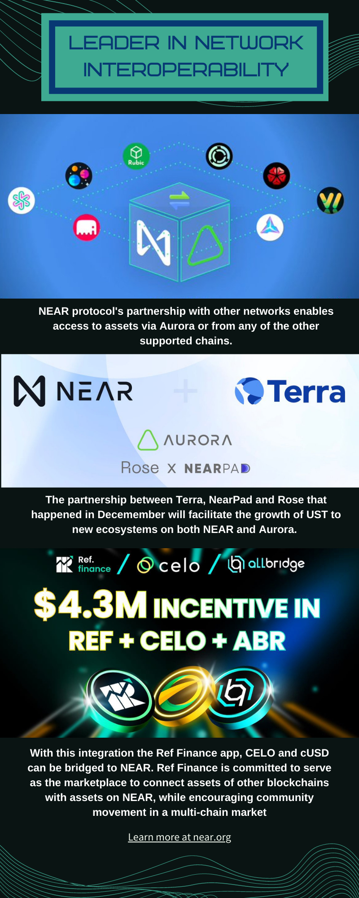

# NEAR_protocol_collection
<p>

</p>

## Bounties to NEAR protocol 
NEAR Protocol - Infographic, Blog, Frontend and Tutorial 

## Near Video bounty - below youtube link 
<br />
<a href="https://www.youtube.com/watch?v=w-y2LMpqun0&ab_channel=neuralnets" target="_blank">Youtube NEAR tutorial </a>
<br />

## SOCIAL MEDIA BOUNTY  
Blog is deployed on medium, this is the link to the medium blog

<br />
<a href="https://medium.com/@kotcherlakota.chaitanya/near-protocol-token-what-is-near-protocol-355a7e03ef9e" target="_blank">Medium Blog On NEAR Protocol  </a>
<br />

## Near Infographic - Bounty 

the infographic for the bounty are uploaded into the folder called infographics 



<video src="./infographics/FM28J5DaMAMgwWP.mov" width="400">


## Frontend for NEAR contract Bounty demo image:


----

### Getting Started with Frontend Bounty

npm:
```sh
npm install
npm run dev
npm run build
npm run contract:build
npm run contract:dev:deploy
npm run contract:deploy
npm run contract:test
```
