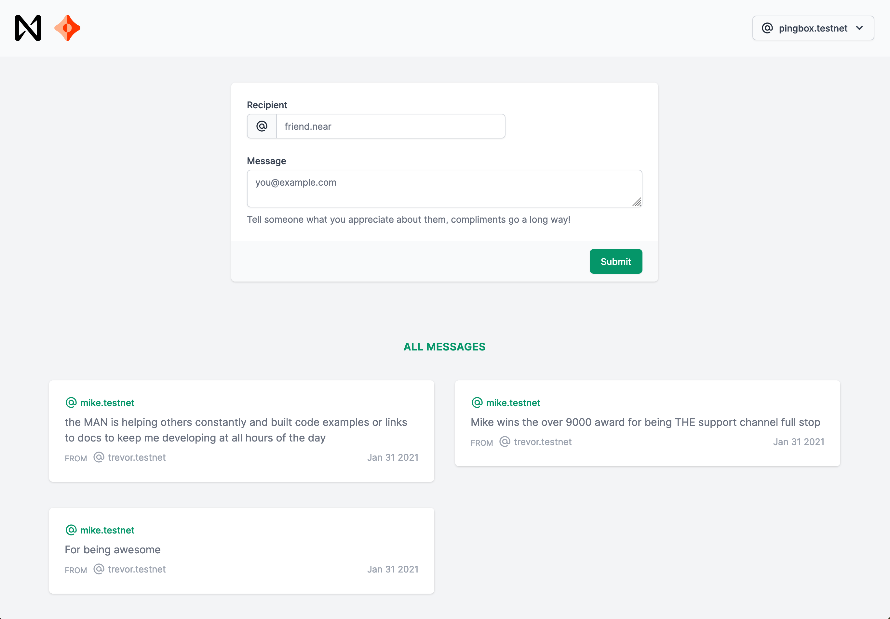

# NEAR_protocol_collection
NEAR Protocol - Infographic, Blog, Frontend and Tutorial 


<br />
<br />

<p>

</p>

<p>

</p>

<br />
<br />


### Example UI:



----

### Getting Started 🚀

npm:
```sh
npm install
npm run dev
npm run build
npm run contract:build
npm run contract:dev:deploy
npm run contract:deploy
npm run contract:test
```
